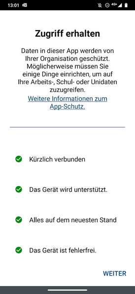
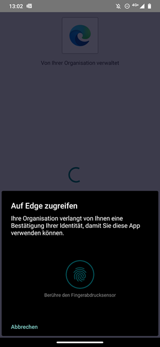

---
hide:
  - navigation
---

## Multifaktor Authentifizierung (MFA)
Gleichzeitig mit der Migration Ihres Postfaches in die Cloud, werden wir auch die Multifaktor Authentifizierung für Ihren Account aktivieren.  

{ width="800" }
{ width="800" }

Es handelt sich bei MFA um eine zusätzliche Absicherung Ihres Campus Accounts, wodurch Sie bei Verbindungen von ausserhalb der UniBE zu Applikationen der Universität Bern Ihre Anmeldung mit einer geeigneten MFA Methode bestätigen müssen.

### Registrierung
In Ihrer Abteilung wurde MFA bereits eingeführt, eine Registrierung ist daher nicht mehr notwendig.  

Falls Sie Änderungen an Ihren MFA Einstellungen vornehmen möchten, können Sie dies über die nachfolgende URL machen:  
:fontawesome-solid-arrow-right: [mfa.unibe.ch](https://mfa.unibe.ch/)

### MFA Methoden
Wir unterstützen an der Universität Bern die nachfolgenden MFA Methoden.  

#### Bevorzugte Methode
- Push via Microsoft Authenticator  
Sie erhalten eine Benachrichtigung auf Ihrem Smartphone, welche Sie bestätigen oder ablehnen können.  
{ width="400" }

#### Weitere Methoden
- Time-based One Time Password (TOTP)  
(Authy, Google Authenticator, FreeOTP, etc.)  
{ width="300" }
- SMS
- *(Early Adopter) Passwordless via FIDO2*

!!! warning
    Sollten Sie noch die Methode "Telefonanruf" aktiviert haben, empfehlen wir dringend, diese gegen eine andere Methode zu ersetzen, da sie in den nächsten Monaten deaktiviert wird.

### Wo muss ich MFA durchführen?
MFA ist derzeit bei folgenden Dienstleistungen aktiv:  

- Fortinet VPN
- Microsoft 365 Services wie Office, OneDrive, Teams, E-Mail, etc.
- Microsoft Azure Services
- Weitere Applikationen, bei welchen die zuständige Stelle MFA erzwingt

### Wann muss ich MFA durchführen?
**Allgemein - MFA wird angefordert wenn:**  

- Sie eine Verbindung zum UniBE-VPN herstellen
- Sie von ausserhalb des UniBE-Netzwerks oder ohne aktive VPN Verbindung auf Dienstleistungen der UniBE zugreifen
- Ihr Account als Risiko eingestuft wurde
- Ein Anbieter einer Dienstleistung MFA explizit anfordert

**Allgemein - MFA wird nicht angefordert wenn:**  

- Sie die Verbindung auf eine Dienstleistung aus dem Netzwerk der UniBE herstellen oder eine aktive VPN Verbindung zur UniBE aufgebaut haben
- Ihr Account keine oder eine geringe Risikostufe hat
- Ein Anbieter einer Dienstleistung MFA nicht anfordert

**VPN Verbindung**  
:fontawesome-solid-clock: 14h  

Nach einer erfolgreichen Anmeldung mit Ihrem Campus Account und einer MFA Verifizierung werden Sie bei einem erneuten Verbindungsaufbau von demselben Client aus während 14 Stunden nicht mehr nach Ihrem Passwort oder MFA gefragt.

**Verbindung über einen Browser**  
:fontawesome-solid-clock: 7d  

Wenn Sie mit einem Browser auf gesicherte Dienstleistungen zugreifen oder eine progressive Web Applikation (PWA) verwenden, müssen Sie sich alle 7 Tage mit Ihrem Campus Account anmelden und eine MFA Verifizierung durchführen.  
Beachten Sie bitte, dass dies den Idealfall beschreibt. Etwaige Session/Cookie Add-ons oder Ad-Blocker können diesen Wert negativ beinflussen.  

Ebenfalls wird eine erneute MFA Verifizierung verlangt, falls sich die Version oder Einstellungen Ihres Browser oder des Betriebsystems verändern.  

**Verbindung über eine ClientApp**  
:fontawesome-solid-clock: 90d  

Bei der Verbindung über eine Client Applikation wird nach 90 Tagen Inaktivität eine erneute MFA Verifierung verlangt.  
Durch die Verwendung der Applikation wird der Zeitraum wieder auf 90 Tage angehoben.  

Ebenfalls wird eine erneute MFA Verifizierung verlangt, falls sich die Version oder Einstellungen Ihrer Client Applikation oder des Betriebsystems verändern.  

**Verbindung mit einem verwalteten Client (MITWP)**  
:fontawesome-solid-clock: --  

Wird Ihr Client durch die zentralen Informatikdienste verwaltet und handelt es sich dabei um ein Modern-IT Workplace Gerät (MITWP), so wird die Sicherheit durch spezielle Geräte- und Applikationsrichtlinien sichergestellt.  
Mit einem solchen, verwalteten MITWP-Client werden Sie daher nicht zur MFA Verifizierung aufgefordert.  

## Microsoft Endpoint Manager (MEM)
An Ihrem Institut werden die mobilen Applikationen auf Ihrem Smartphone durch die zentralen Informatikdienste verwaltet.  

**Die Verwaltung beschränkt sich auf:**  

- Microsoft Applikationen, an welchen Sie sich mit Ihrem Campus Account angemeldet haben.

Durch die Verwaltung dieser Applikationen mit MEM, werden die Applikationsdaten verschlüsselt auf Ihrem Smartphone abgelegt. Ebenfalls wird die MFA Verifizierung durch eine PIN- oder biometrische Verifizierung ersetzt.  

Beim ersten Start nach der Migration, wird Ihnen eine entsprechende Information angezeigt:  
{ width="280" }  

Anstelle einer MFA Verifizierung werden Sie regelmässig zur Eingabe Ihres Geräte-PINs oder einer biometrischen Verifizierung aufgefordert, je nachdem, was Sie auf Ihrem Smartphone als Entsperrmethode eingestellt haben.  
{ width="280" }  

### SWITCH edu-ID
Bei der SWITCH edu-ID handelt es sich um einen dedizierten Account mit eigenem Passwort.  
Da dieser Account nicht durch die Universität Bern verwaltet wird, gelten die Vorgaben von SWITCH oder den Anbietern der jeweiligen SWITCH edu-ID Dienstleistung.  

:fontawesome-solid-arrow-right: Bezogen auf die aktuelle Migration hat diese also keinen Einfluss auf das Anmeldeverhalten der edu-ID.  

&nbsp;  

[:fontawesome-solid-circle-chevron-left: Unterstützte Clients ](../migration/supported-clients.md){ .md-button }

[Teams Telefonie :fontawesome-solid-circle-chevron-right:](../migration/teams-phonecalls.md){ .md-button .md-button--primary }

