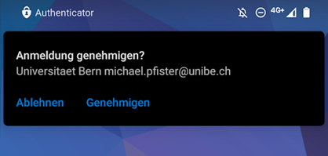
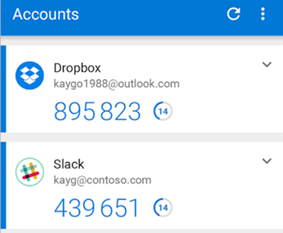

---
hide:
  - navigation
---

!!! tip "Im Aufbau"
    Der Abschnitt befindet sich im Aufbau.

## Multifaktor Authentifizierung (MFA)
Gleichzeitig mit der Migration Ihres Postfaches in die Cloud, werden wir auch die Multifaktor Authentifizierung für Ihren Account aktivieren.  

{ width="800" }
{ width="800" }

Es handelt sich bei MFA um eine zusätzliche Absicherung Ihres Campus Accounts, wodurch Sie bei Verbindungen von ausserhalb der UniBE zu Applikationen der Universität Bern Ihre Anmeldung mit einer geeigneten MFA Methode bestätigen müssen.

### MFA Methoden
Wir unterstützen an der Universität Bern die nachfolgenden MFA Methoden.  

#### Bevorzugte Methode
- Push via Microsoft Authenticator  
Sie erhalten eine Beanchrichtigung auf Ihrem Smartphone, welche Sie bestätigen oder ablehnen können.  
{ width="400" }

#### Weitere Methoden
- Time-based One Time Password (TOTP)  
(Authy, Google Authenticator, FreeOTP, etc.)  
{ width="300" }
- SMS
- *(Early Adopter) Passwordless via FIDO2*

!!! warning
    Sollten Sie noch die Methode "Anruf per Telefon" aktiviert haben, empfehlen wir dringend diese gegen eine andere Methode zu ersetzen, da sie in den nächsten Monaten deaktiviert wird.

### Wo muss ich MFA durchführen?
MFA ist derzeit bei folgenden Dienstleistungen aktiv:  

- Fortinet VPN
- Microsoft 365 Services wie Office, OneDrive, Teams, E-Mail, etc.
- Microsoft Azure Services
- Weitere Applikationen, bei welchen die zuständige Stelle MFA erzwingt

### Wann muss ich MFA durchführen?

### SWITCH edu-ID
Bei der SWITCH edu-ID handelt es sich um einen dedizierten Account mit eigenem Passwort.  
Da dieser Account nicht durch die Universität Bern verwaltet wird, gelten die Vorgaben von SWITCH oder den Anbietern der jeweiligen SWITCH edu-ID Dienstleistung.  

Bezogen auf die aktuelle Migration hat diese also keinen Einfluss auf die edu-ID.  
{ width="450" }
{ width="450" }

### Registrierung

## Microsoft Endpoint Protection (MEM)

&nbsp;  

[:fontawesome-solid-circle-chevron-left: Unterstützte Clients ](../migration/supported-clients.md){ .md-button }

[Neue Möglichkeiten :fontawesome-solid-circle-chevron-right:](../migration/new-possibilities.md){ .md-button .md-button--primary }

