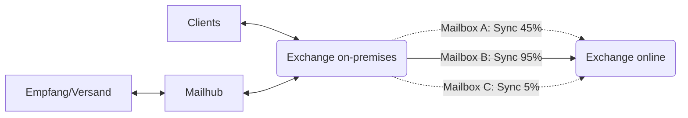
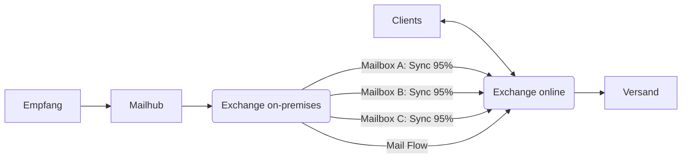

---
hide:
  - navigation
---

## Während der Migration
Nach dem Start und während der Migration ändert sich für Sie nichts. Ihr Client bleibt mit der lokalen Mailbox verbunden und die E-Mails treffen auch weiterhin dort ein.  
Der Inhalt Ihrer Mailbox wird jedoch laufend an Exchange online übertragen bis die Übertragung zu 95% abgeschlossen ist.  

!!! tip
    Da es sich hier um eine Übertragung von Daten über Drittanbieter-Netzverbindungen in einen Cloud Service handelt, über die/den wir keine Kontrolle haben, können wir nicht abschätzen, wie lange die Migration dauern wird.  
    Wir rechnen damit, dass wir die Migration am 27.04.2022 abschliessen können.

## Abschluss der Migration
Haben alle Mailboxen den Übertragungsstatus von 95% erreicht, stellen wir auf Exchange online um. Die noch ausstehenden Elemente werden nachmigriert, auf der lokalen Mailbox treffen nun aber keine neuen E-Mails mehr ein.  
Ab diesem Zeitpunkt muss ihr Client eine Verbindung mit Exchange online herstellen, um weiterhin E-Mails versenden oder empfangen zu können.  
Ebenfalls ab diesem Zeitpunkt aktivieren sich die [neuen Funktionen](../migration/new-possibilities.md) auf Ihrer Mailbox.

&nbsp;  

[:fontawesome-solid-circle-chevron-left: Übersicht ](../index.md){ .md-button }

[Vor der Migration :fontawesome-solid-circle-chevron-right:](../migration/pre-migration.md){ .md-button .md-button--primary }

