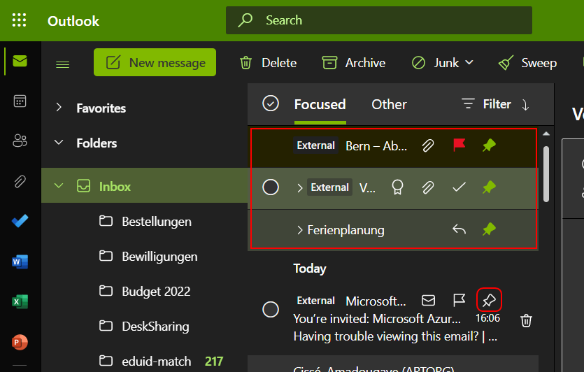

---
hide:
  - navigation
---

## Allgemein
### Spam, Phishing und Malware Schutz
Ihre Mailbox wird ab sofort durch zusätzliche Sicherheitsmechanismen vor gefährlichen Nachrichten geschützt.  

#### Externe Absender
Eine simple Massnahme besteht darin, dass Ihnen nun angezeigt wird, wenn eine E-Mail von einem externen Absender stammt oder wenn Sie eine E-Mail von einer Person erhalten, mit welcher Sie keinen oder wenig Kontakt haben.  
{ width="550" }  
{ width="650" } 

#### Spam, Phishing und Malware
Weiter werden eingehende E-Mails durch eine künstliche Intelligenz geprüft, mit den neuesten Spam, Phishing und Malware Listen abgeglichen und durch von uns erstellte Filter geschickt.  
Diese ausgefilterten Nachrichten werden ab sofort nicht mehr direkt in Ihre Mailbox ausgeliefert sondern in einem separaten, gesicherten Speicher zurückgehalten.  

Sie werden daher nun am Morgen mit einer entsprechenden E-mail benachrichtigt, falls am Vortag E-Mails ausgefiltert wurden und können direkt in dieser E-Mail das weitere Vorgehen auswählen.  
{ width="700" } 

!!! tip
    Sollten Sie auf eine E-Mail warten und davon ausgehen, dass diese ausgefiltert wurde, können Sie unter der nachfolgenden URL jederzeit die gefilter Objekte einsehen:  
    [https://security.microsoft.com/quarantine?viewid=Email](https://security.microsoft.com/quarantine?viewid=Email)

#### Safelink Schutz
Links, welche Sie per E-Mail oder auch in Teams und anderen Microsoft Applikationen erhalten, werden beim Anklicken erst gegen aktuelle Malware und Phishing Listen geprüft. Diese Prüfung geschieht anonym, es wird also nur der Link, nicht aber persönliche Daten von Ihnen übermittelt.  

Durch diese Methode kann nun erheblich schneller auf Phishinglinks beim Massenversand von E-Mails reagiert werden.

## Teams
### Terminabgleich mit Teams
Teams verwendet nun denselben Kalender wie Ihr Postfach. Dadurch wird auch der Teams-Status aus Ihrem Kalender übernommen sofern Sie den Status nicht manuell übersteuert haben.
{ width="550" } 

Abwesenheitsmeldungen, die Sie in Ihrem Postfach setzen werden ebenfalls in Teams übernommen und Personen angezeigt, welche Sie anschreiben.

### Vollständige Freischaltung von Events
Sie haben nun über Ihren Teams-Kalender uneingeschränkten Zugriff auf die Meeting-Funktionen von Teams und können dadurch nebst den bereits bekannten Meetings auch Webinare und Live events planen, welche sich an ein grösseres Publikum richten und zusätzliche Einstellungsmöglichkeiten bieten.  
{ width="400" } 

!!! tip
    Live-Events sind für mehrere 1000 Teilnehmende gedacht, hier sollten Sie unbedingt mit einem Presenter zusammenarbeiten der sich um das Umschalten der Sprecher und Präsentationen kümmert, damit Sie sich auf Ihren Vortrag fokussieren können.  
    Live events können bei Bedarf auch in Webseiten eingebunden werden.

## Microsoft Outlook MobileApp
Mit dem Wechsel in die Cloud wurde auch die offizielle Outlook MobileApp für Ihr Smartphone freigeschaltet, Sie können diese über die jeweiligen App Stores beziehen.  

[:fontawesome-brands-google-play: Google Play](https://play.google.com/store/apps/details?id=com.microsoft.office.outlook){ .md-button } [:fontawesome-brands-app-store-ios: App Store](https://apps.apple.com/us/app/microsoft-outlook/id951937596){ .md-button }

### Später erinnern
In den Einstellungen der Outlook mobile können Sie festlegen, wie auf eine Wischaktion reagiert werden soll.  
Unsere Empfehlung ist die Einrichtung der Lösch- und Erinnerungsfunktion:  
{ width="320" } { width="320" }  

Damit können Sie E-Mails für welche Sie später lesen möchten für eine bestimmte Zeit ausblenden. Nach der gewählten Zeit erscheint Sie dann wieder als neue Nachricht in Ihrem Posteingang.  
{ width="320" } { width="320" }  

## Webmail - Outlook WebApp (OWA/PWA)
Auch die Outlook WebApp wurde runderneuert und stellt die aktuell modernste und einfachste Methode dar, um auf Ihr Postfach zuzugreifen.  
Da nur die Outlook WebApp sämtliche Funktionen von Exchange online unterstützt, immer auf dem aktuellen Stand und plattformunabhängig ist, stellt sie den von uns empfohlenen Client für Ihren Desktop dar.  

Sie können die WebApp auf zwei Arten verwenden, entweder direkt über den von Ihnen bevorzugten Webbrowser oder aber als progressive Webapplikation (PWA).  

[:fontawesome-solid-link: Outlook WebApp](https://outlook.office.com){ .md-button }

Sofern Ihr Browser progressive Webapplikationen unterstützt erhalten Sie nach der Anmeldung im Browser die Option zur Installation angezeigt.  
{ width="500" }  

!!! info
    Es handelt sich dabei nicht wirklich um eine Installation.  
    Ihr Browser legt nur ein Symbol in der Taskleiste Ihres Betriebssystems an und startet die Webapplikation in einem eigenen Fenster ohne die ganzen zusätzlichen Browserfunktionen. Effektiv arbeiten Sie aber in Ihrem Browser.  

    Die einzige Besonderheit liegt darin, dass die neuesten Web-Technologien zum Einsatz kommen, so dass Sie beispielsweise auch bei einem Ausfall der Internetverbindung auf die zuletzt geöffneten E-Mails zugreifen oder eine neue E-Mail schreiben können. Nach der Wiederherstellung der Verbindung werden diese Daten dann übermittelt.

### Anstehende Termine
Anstehende Termine werden Ihnen neu in der Form von wechslenden Terminkarten angezeigt über welche Sie auch direkt an einem Teams-Meeting teilnehmen können.  
{ width="400" } 

Alternativ können Sie sich einen Scheduler anzeigen lassen, der Sie durch den Tag führt und stets anzeigt, welche Termine als nächstes anstehen.  
{ width="650" } 

### Anpinnen von E-Mails
Wenn Sie trotz Ordnern, diverser Ansichten und dem Markieren von E-Mails immer wieder die Übersicht verlieren, haben Sie neu die Möglichkeit E-Mails anzupinnen, so dass diese immer ganz oben in Ihrer Mailbox angezeigt werden.  
{ width="650" } 

### Suchen und finden
Die Suche beschränkt sich nicht länger nur auf E-Mails sondern durchsucht auch die Anhänge, Ihre Dateien sowie auch Dateien, die mit Ihnen geteilt wurden.  
{ width="650" } 

### Übersicht der Anhänge
Da die Anhänge nun unabhängig von der E-Mail Nachricht gespeichert werden, haben Sie neu auch die Möglichkeit sich ausschliesslich die Mailanhänge anzeigen zu lassen.  
{ width="650" } 

### Todo Integration
Die Funktionen von Microsoft ToDo zur Planung Ihrer Aufgaben stehen in ab sofort vollumfänglich zur Verfügung und ist in die Outlook WebApp integriert.  
{ width="400" }

[:fontawesome-solid-clipboard-list: Microsoft ToDo](https://to-do.office.com/){ .md-button }

### Termine und Räume
Beim Erstellen von Terminen werden Ihnen nach dem Hinzufügen von Teilnehmern nun automatisch mögliche Termine vorgeschlagen.  
{ width="850" } 

Das gleiche gilt für Räume.  
{ width="400" } 

Aber wenn Sie bestimmte Anforderungen an den Raum haben, können Sie auch den ***Room Finder*** verwenden, um einen geeigneten Ort für Ihr Meeting zu finden.  
{ width="850" } 

### Notizen und Aufgaben
Sie haben jetzt auch die Möglichkeit, Textstellen in einer E-Mail zu markieren und daraus beispielsweise eine Aufgabe zu generieren.  
{ width="500" }

Oder machen Sie sich Notizen zu einer E-Mail.  
{ width="500" }  
{ width="500" }  

### :fontawesome-solid-flask: Gruppenmitgliedschaften (im Aufbau)
Verwalten Sie Teams-Gruppen, denen Sie folgen, direkt in der Outlook WebApp.  
{ width="850" }

### :fontawesome-solid-flask: FindTime (Im Aufbau)
Mit FindTime haben Sie die Möglichkeit eine Auswahl an Terminen an Personen ausserhalb der UniBE zu senden, welche normalerweise keinen Zugriff auf Ihren Kalender haben.  

{ width="400" }  

Die eingeladene Person wählt den gewünschten Termin aus, wodurch automatisch ein Eintrag in Ihrem Kalender erstellt und eine Termineinladung an die externe Person versendet wird.

&nbsp;  

[:fontawesome-solid-circle-chevron-left: Teams Telefonie](../migration/teams-phonecalls.md){ .md-button }

