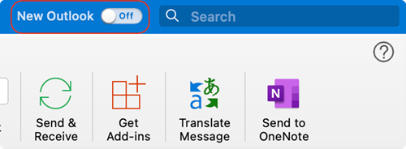

---
hide:
  - navigation
---

## Allgemein
Beachten Sie unsere Anleitungen im [Service Portal](https://serviceportal.unibe.ch/sp?id=kb_article_view&sysparm_article=KB0010440) und ziehen Sie diese zu Rate wenn es nach der Migration zu Anmeldeproblemen kommen sollte.  

Wenn Sie auch damit keinen Erfolg haben, wenden Sie sich an die für Ihr Institut verantwortliche, [technikverantwortliche Person](https://intern.unibe.ch/dienstleistungen/informatik/dienstleistungen_der_informatikdienste/it_verantwortliche/liste_der_it_verantwortlichen/index_ger.html).

## Outlook für Windows
Sie erhalten eine Meldung, dass Ihr Outlook Client neu gestartet werden muss und es treffen keine neuen E-Mails mehr ein.  

:fontawesome-solid-arrow-right: Starten Sie Outlook neu. Es wird automatisch eine Verbindung mit Ihrer Cloud-Mailbox hergestellt.

## Outlook für macOS
Sie erhalten eine Passworteingabeaufforderung.  

:fontawesome-solid-arrow-right: Ignorieren Sie die Meldung und starten Sie Outlook neu. Es wird automatisch eine Verbindung mit Ihrer Cloud-Mailbox hergestellt.  

### Passwort-Aufforderung und geteilte Postfächer
Weiterhin wurde uns gemeldet, dass es nach der Migration Probleme beim Zugriff auf geteilte Postfächer geben kann.  
Womöglich löst sich dieses Problem durch die Migration der geteilten Postfächer in die Cloud, aber falls Sie Probleme haben sollten, hilft es Outlook zu schliessen und die gespeicherten Passwörter von Outlook im Schlüsselbund von macOS zu entfernen.  

### Funktion - Das neue Outlook
Outlook bietet Ihnen seit einiger Zeit an, auf das "neue Outlook" Erlebnis zu wechseln.  

{ width="400" } 

Auch nach der Migration Ihres Postfaches sollten Sie diese Einstellungen ***nicht*** aktivieren, denn diese neue Version ist noch nicht für den Umgang mit einem hybriden Aufbau vorbereitet wie er an der UniBE die nächsten Jahre bestehen wird.  

**Vorgehen**[^1]  
Öffnen Sie die Schlüsselbund-Verwaltung und entfernen Sie die nachfolgenden Einträge:  

- Exchange
- Microsoft Office Identities…
- MSOpenTech.*
- Etwaige, "OC" Einträge

## Webmail (OWA)
Nach der Migration wird ein Zugriff auf das bisherige Webmail ([mail.unibe.ch](https://mail.unibe.ch) bzw. [mail.campus.unibe.ch](https://mail.campus.unibe.ch)) nicht mehr möglich sein.  
Bei einem Zugriffsversuch wird Ihnen entweder eine Fehlermeldung angezeigt oder Sie erhalten einen Link zum neuen Webmail System.  
{ width="500" } 

:fontawesome-solid-arrow-right: Ab diesem Zeitpunkt muss für den Zugriff auf das Webmail die Adresse [https://outlook.office.com](https://outlook.office.com) verwendet werden.

### Basiseinstellungen vornehmen

## Andere MailClients und Mobile Apps
Aufgrund der Vielfalt an Betriebssystemen und Clients ist es schwer vorauszusagen wie die Auswirkungen sind.  

:fontawesome-solid-arrow-right: In unseren Tests und den bisherigen Migrationen musste bei mobilen Applikationen das E-Mail Profil in den Applikationen gelöscht und neu erstellt werden.  

## Teams - Voicemail-Nachrichten
Nach der Migration kann es passieren, dass Voicemail-Nachrichten in Teams fälschlicherweise als Anrufe angezeigt werden.  
Zur Bereinigung sind die Voicemail-Nachrichten manuell aus dem ***Verlauf*** zu löschen. Anschliessend ist Microsoft Teams über ***Abmelden*** neu zu starten.  
{ width="600" } 

[^1]:
    Quelle: [michaelkummer.com](https://michaelkummer.com/tech/outlook-password-issue/)

&nbsp;  

[:fontawesome-solid-circle-chevron-left: Vor der Migration ](../migration/pre-migration.md){ .md-button }

[Unterstützte Clients :fontawesome-solid-circle-chevron-right:](../migration/supported-clients.md){ .md-button .md-button--primary }

