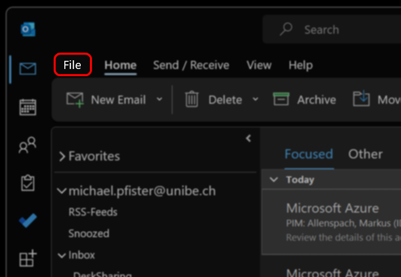
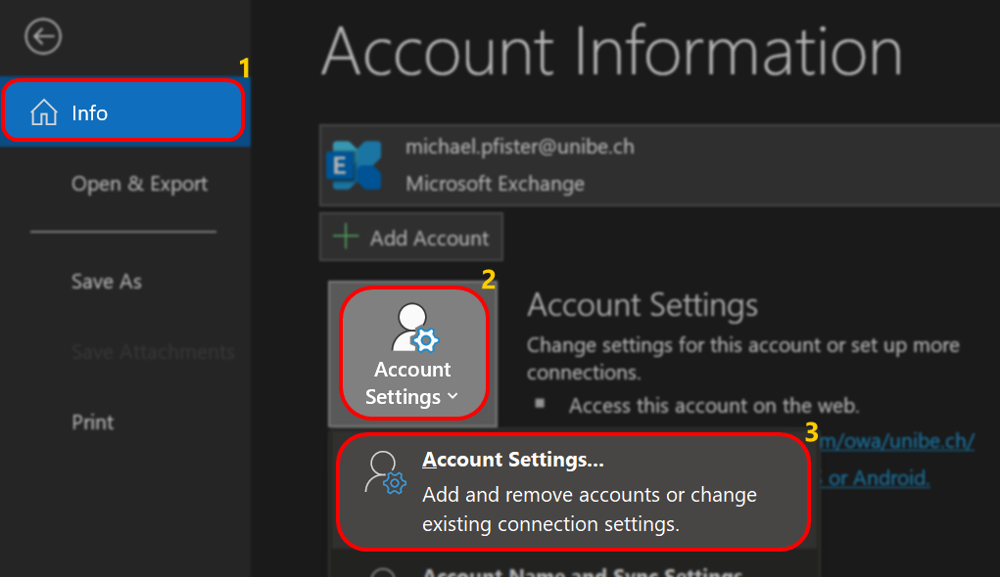
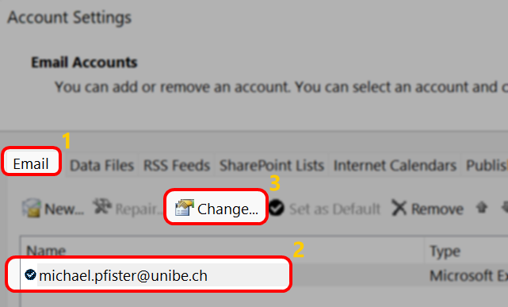
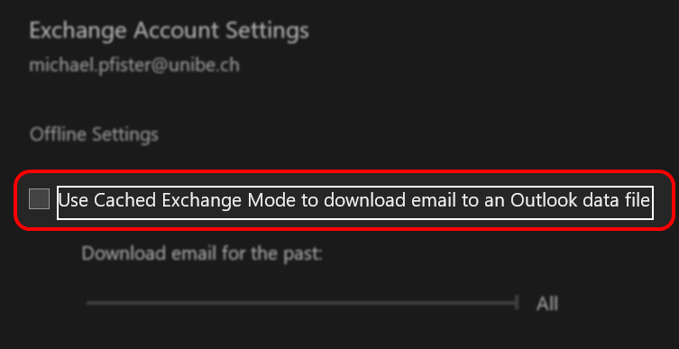

---
hide:
  - navigation
---

## Outlook Cache deaktivieren

Wir haben festgestellt, dass ein aktiver Outlook Cache dazu führt, dass Kontakt- und Kalenderobjekte doppelt angezeigt werden und der lokale Cache sich nicht aktualisiert.  

**Wir empfehlen daher dringend, den Outlook Cache vor der Migration zu deaktivieren** und auch nach der Migration deaktivert zu lassen oder frühestens nach 14 Tagen zu reaktivieren.  

### Outlook für Windows

1. Öffnen Sie den Outlook Client
2. Klicken Sie auf ***File***  
{ width="500" }  

3. Wechseln Sie in die Accounteinstellungen  
{ width="500" }  

4. Wählen Sie Ihren Account an und bearbeiten Sie die Einstellungen durch einen Klick auf ***Change...***  
{ width="500" }  

5. Stellen Sie sicher, dass der Cache deaktiviert, also nicht ausgewählt ist, und bestätigen Sie die Einstellung  
{ width="500" }  

&nbsp;  

[:fontawesome-solid-circle-chevron-left: Übersicht ](../index.md){ .md-button }

[Nach der Migration :fontawesome-solid-circle-chevron-right:](../migration/post-migration.md){ .md-button .md-button--primary }

