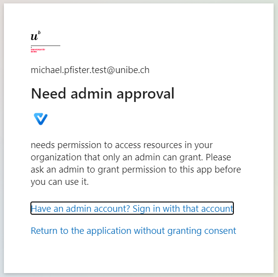
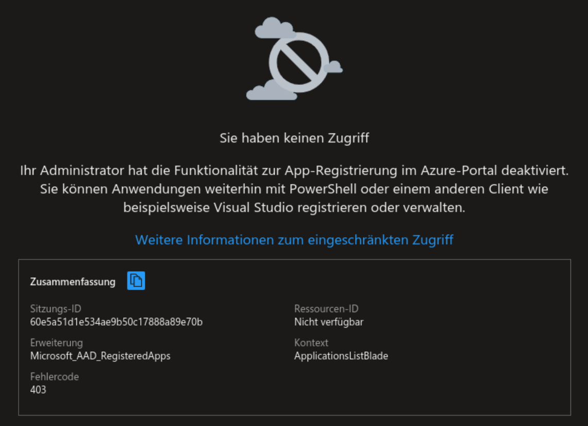

---
hide:
  - navigation
---

## Unterstützte Clients
Eine aktuelle Liste der unterstützten Clients finden Sie im [Service Portal](https://serviceportal.unibe.ch/sp?id=kb_article_view&sysparm_article=KB0010440)  

!!! info
    Beachten Sie bitte, dass sich der Support auf die Outlook Clients und die Outlook WebApp (Webmail) beschränkt.

## Empfohlener Client
Wir empfehlen Ihnen die Verwendung des Webclients beziehungsweise der Progressive Web App von Outlook.  
Sie haben dadurch stets die aktuellste Version von Outlook inklusive Features, welche im normalen Client nicht zur Verfügung stehen.  
Der Webclient ist zudem plattformunabhängig.

{ width="800" }
{ width="800" }

Mehr Informationen dazu finden Sie auf der Seite [Neue Möglichkeiten](../migration/new-possibilities.md).  

## Clients mit Modern Authentication
Clients welche eine Modern Authentication(1) unterstützen, können auch weiterhin für den Zugriff auf das Postfach verwendet werden. 
{ .annotate }  

1.  :fontawesome-solid-question: Unter ***Modern Authentication*** versteht man eine Anmeldung über die Protokolle oAuth2, OIDC und SAML2.  
Der Vorteile dieser standardisierten Protokolle liegt darin, dass diverse Bedingungen für eine sichere Kommunikation erfüllt sein müssen und Erweiterungen wie MFA, Passwordless oder auch Conditional Access Policies unterstützt werden.

Wir haben versucht die gängigen Clients vorzuerfassen, welche dies bereits heute unterstützen, falls Sie jedoch einen Client verwenden den wir noch nicht registriert haben, wird bei der Anmeldung eine Fehlermeldung mit einem Hinweis angezeigt, dass Sie sich an Ihren Administrator wenden sollen.  
{ width="350" } 
{ width="500" }

Melden Sie sich in einem solchen Fall bei uns [aai.id@unibe.ch](mailto:aai.id@unibe.ch) damit wir prüfen können, ob der Client hinzugefügt werden kann.

## Clients mit Basic Authentication
Clients, die auf unsichere Authentisierungsmechanismen setzen, sind nach der Migration nicht mehr in der Lage eine Verbindung mit dem Postfach herzustellen und können daher nicht weiterverwendet werden.  

&nbsp;  

[:fontawesome-solid-circle-chevron-left: Nach der Migration ](../migration/post-migration.md){ .md-button }

[MFA Timings und MEM :fontawesome-solid-circle-chevron-right:](../migration/mfa-mem.md){ .md-button .md-button--primary }

