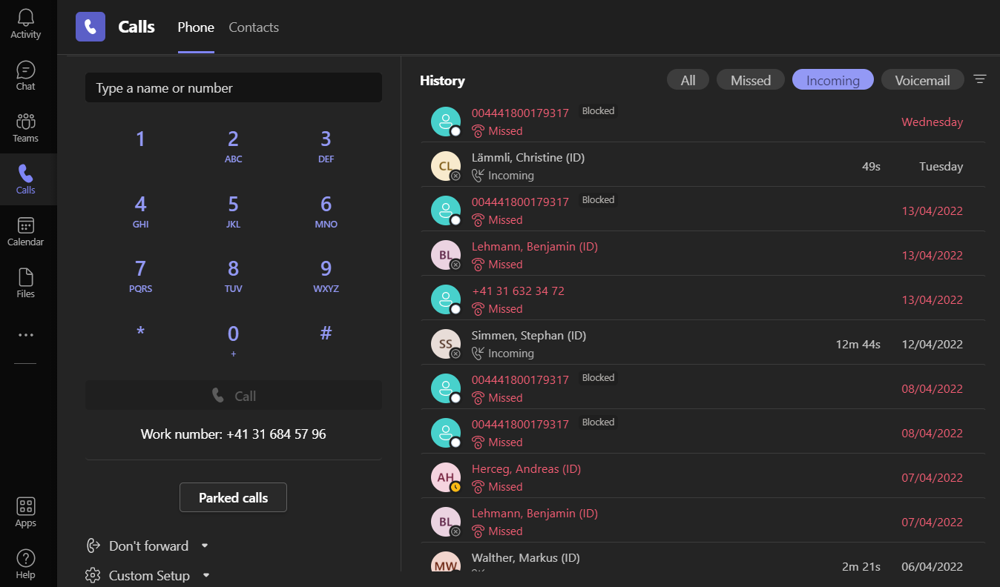

---
hide:
  - navigation
---

In Ihrer Abteilung wurde die Teams-Telefonie bereits vorgängig aktiviert.  
Empfangen und tätigen Sie Anrufe über Ihre UniBE Telefonummer direkt in Teams, unabhängig von Ihrem Standort.  
{ width="850" }  

&nbsp;  

[:fontawesome-solid-circle-chevron-left: MFA und MEM ](../migration/mfa-mem.md){ .md-button }

[Neue Möglichkeiten :fontawesome-solid-circle-chevron-right:](../migration/new-possibilities.md){ .md-button .md-button--primary }

